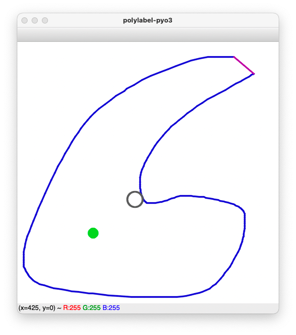

[](https://github.com/MoonVision/polylabel-pyo3/actions/workflows/test.yml)
[](https://github.com/MoonVision/polylabel-pyo3/actions/workflows/build.yml)
[](https://github.com/MoonVision/polylabel-pyo3/actions/workflows/bench.yml)

# polylabel-pyo3

`polylabel-pyo3` lets you calculate the [pole of inaccessibility](https://github.com/mapbox/polylabel) in Python. It's a [pyo3](https://github.com/PyO3/pyo3) wrapper of [polylabel-rs](https://github.com/urschrei/polylabel-rs).

## Install

```
pip install polylabel-pyo3
```

## Use

```python
from polylabel_pyo3 import polylabel_ext, polylabel_ext_np

# define an open L-shape
L = [(0,0),(1,0),(1,1),(2,1),(2,2),(0,2)]

polylabel_ext(L, 1.0)
# (0.5, 0.5)

# A version for numpy.ndarray only is slightly faster
import numpy as np
polylabel_ext_np(np.array(L, dtype=np.float), 1.0)
# (0.5, 0.5)

# Note that the optional polylabel center for an L-shape
# is in between its mean of exterior vertices and origin
np.mean(L, axis=0)
# array([1., 1.])
```

## GUI Example

```
pip install -r examples/requirements.txt
python examples/polylabel_gui.py
```

Drag your shape with the mouse and observe a `momentum` based center in grey and `polylabel` center in green:



## Develop

Requirements:

- Rust Toolchain
- Python >=3.6

In a `venv` or conda `env`:
```
pip install maturin -r requirements.txt
pre-commit install
```

### Test

```
maturin develop
pytest -v
```

### Benchmark

```
maturin develop --release
pyest benchmark
```
